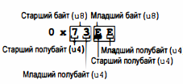
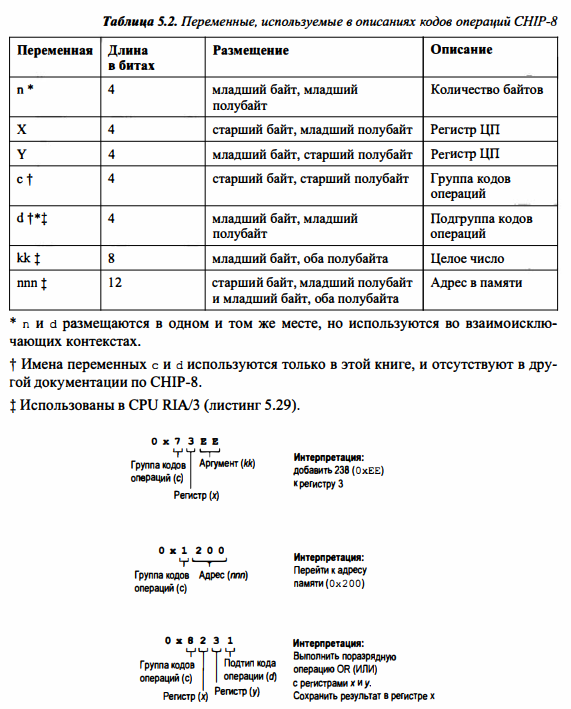

# Реализация подмножества системы CHIP-8

## CPU RIA/1: сумматор

**Операция(op)** - процедура, изначально поддерживаемая процессором;  
**Регистры** - контейнеры для данных, к которым CPU имеет непосредственный доступ.  

    Для работы большинства операций операнды должны быть помещены в регистры. *У CHIP-8 регистры имеют формат u8.*

**Код операции** - число, отображаемое на операцию. На платформе CHIP-8 коды операций включают в себя регистры операций и операндов.  

**//# 1**  
Для выполнения суммирования:

1. Инициализация CPU;
2. Загрузить значения ***u8*** в регистры;
3. Загрузить код операции в переменную текущей операции;
4. Выполнить операцию.

Каждый код операции состоит из двух байтов: старшего и младшего.  
Каждый байт состоит из полубайтов (тетрад): старшего и младшего.  
  
  
