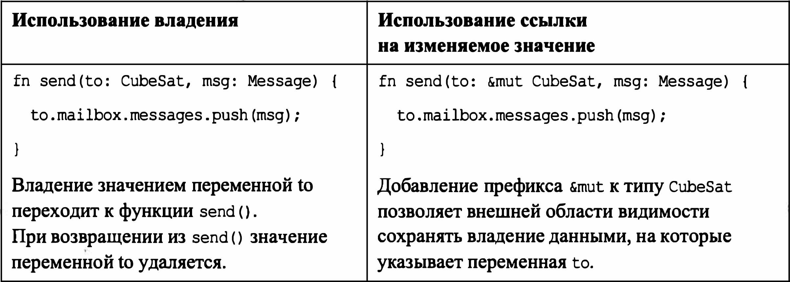
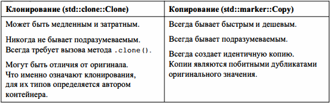

# CubeSat (работа с BorrowChecker)

## Ошибка 1
В строке [1] владение переходит к локальной переменной *sat_id* функции check_status().
Далее владение не возвращается в область видимости функции main!
Для структуры sat не реализован типаж Copy. **Для простых числовых типов (u8, i32...) он реализован по умолчанию =>
подобной ошибки не возникает, т.к. в локальной области видимости будет создана копия типа.**

`let sat_c  = CubeSat{sat_id:2};
[1]let c_status = check_status(sat_c);
...
[2]let c_status = check_status(sat_c);`

Как только область видимости владельца перестаёт существовать, удалаются все "принадлежащие" ему значения (метод Drop) - вызывается деструктор (внедряется компилятором rustc).

> Каждое значение в Rust - **ВЛАДЕНИЕ**.
Владение - это понятие, используемое в сообществе Rust для обозначения
процесса времени компиляции, который проверяет, что каждое использование значения
допустимо и что каждое значение полностью уничтожено.

Передача владения осуществляется:
- При операции присваивания;
- При передаче через функциональный барьер (в качестве аргумента или возвращаемого значения).

`let sat_c  = CubeSat{sat_id:2};
let sat_new  = sat_c;`
(*sat_new* теперь владеет *CubeSat{sat_id:2}*, *sat_c* - недействительное значение)

## Important
1. Если полное владение не требуется, используются ссылки;
2. Можно продублировать значение;
3. Стоит избегать большого количества "долгоживущих" объектов;
4. Вместо запроса "владения" в определённых функциях можно воспользоваться "заимствованием" (через ссылку);
5. Можно использовать типы-оболочки, предоставляющие совместное владение типом Т.

> Заимствование - использование ссылки на переменную. Для чтения - & T, чтения-записи - &mut T.

## Копирование значений
Копирование элементарных типов - быстрый процесс. Rustc для таких типов вместо перехода владения осуществляет копирование.

Всего существует два режима дублирования: **клонирование** (*типаж std::clone::Clone*) и **копирование** (*типаж std::marker::Copy*)

- Копирование осуществляется подразумеваемым образом: если владение значением переходит во внутреннюю область видимости, то значение просто дублируется (биты объекта **а** реплицируются для создания объекта **b**);

- Клонирование выполнятется явным образом. Типы, в которых имеется реализация *Clone*, содержат метод *.clone()*, которому разрешено делать всё, что ему нужно для создания нового значения

Недостатки использования Copy:
1. Copy не снижает производительность только с типами имеющими фиксированный размер;
2. Т.к. Copy создаёт точные копии, он не способен корректно интерпретировать ссылки;

## Использование типов-оболочек
Повзоляют создавать более гибкий код, но приходится заниматься сборкой мусора (Garbage Collection) самостоятельно.

Тип - оболочка **std::rc::Rc** принимает параметр типа *T* и обозначается как *Rc(T)* - значение типа Т с подсчётом ссылок.

> Rc(T) предоставляет совместное владение T. Совместное владение не позволяет удалять значение типа Т из памяти до тех пор, пока не будут удалены все его владельцы
Для отслеживания действующих ссылок используется подсчёт ссылок - внутренний счётчик. Когда ссылка сбрасывается, счёт уменьшается на единицу. Когда счёт достигает нуля, значение Т также сбрасывается.

В Rc(t) реализуется клонирование Clone. Внутренний счётчик увеличивается при каждом вызове .clone(). 

> Rc(T) не допускает изменений. Чтобы разрешить изменения, нужно заколючить тип-оболочку в другой тип-оболочку. 
Например, Rc(RefCell(T))

> Применение Rc(T) не является потокобезопасным. В многопоточном коде используеют Arc(T) & Arc(Mutex(T))