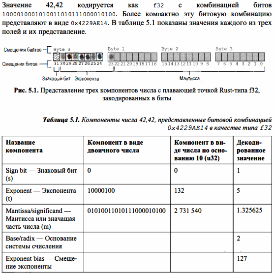

# Модульная система RUST

1. Модули объединяются в контейнеры;
2. Модули могут быть определены структурой каталогов проекта. 
Если каталог *src/* содержит файл *mod.rs*, то его подкаталоги становятся модулями.
3. Модули могут быть определены в файле с помощью ключевого слова *mod*
4. Модули могут иметь произвольные вложения
5. Все элементы млдуля, включая его подмодули, по умолчанию являются закрытыми. Доступ к закрытым элементам можно получить как в самом модуле, так и в любых его потомках
6. Для того, чтобы сделать какую-либо часть модуля доступной, используется ключевое слово *pub*
- pub(crate) предоставляет доступ к элементу другим модулям внутри контейнера (крейта)
- pub(super) предоставляет доступ к элементу со стороны родительского модуля
- pub(in path) предоставляет доступ к элементу в пределах указанного пути
- pub(self) сохраняет открытый досутп к элементу в его модуле
7. Элементы из других модулей переносятся в локальную область видимости с помощью ключевого слова **use**

# Углублённое изучение данных

Одна и та же комбинация битов может означать разные вещи:
`let a: u16 = 50115;
let b: i16 = -15421;
a:0b1100001111000011 = 50115
b:0b1100001111000011 = -15421`

**{:016b}** - перевод в двоичный формат посредством использования трейта std::fmt::Binary с применением дополнения слева в виде 16 нулей

*i32, u32* гарантированно занимают такое же количество бит, как и *f32*.

`std::mem::transmute(frankentype)` - интерпретирует f32 в качестве u32, не затрагивая ни один из исходных битов.

**unsafe{}** - Rust перестаёт гарантировать безопасность памяти программы. Основная цель - взаимодействие с библиотеками, написанные на других ЯП, с интерфейсами ОС. Применение unsafe позволяет выполнять побитные операции чтения и записи.

## Целые числа
Представление целого числа занимает конкретное число бит на тип.

## Числа с плавающей точкой
Каждое число с плавающей точкой хранится в памяти в виде экспоненциальной записи:

**Экспоненциальная запись числа:**
1. Знак;
2. Мантисса - значащая часть числа;
3. Основание системы счисления - значение, возводимое в степень экспоненты;
4. Экспонента - показатель степени - даёт описание шкалы значений.

**Значение с плавающей точкой - контейнер с тремя полями:**
1. Знаковый бит;
2. Показатель степени;
3. Мантисса.

Основание числа с плавающей точкой - 2.

