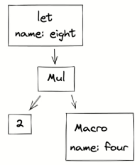
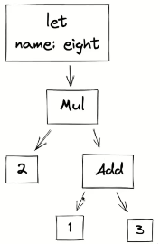

# Макросы

> Работают исключительно во время компиляции  

## Применение  

- Кодогенерация (шаблонизация кода)  
> Генерация повторяющегося (boilerplate) кода
- Обход ограничений языка
- Дедупликация кода
- Рефлексия на этапе компиляции
Можно прочитать на этапе компиляции внутреннюю структуру пользовательского типа

`println!("Hello")` разворачивается в
`::std::io::_print(::core::fmt::Arguments::new_v1(&["Hello\n"],
&match () {
    _args => [],
}));`

## Виды макросов  

1. Декларативные: `println!`
2. Процедурные: `derive: #[derive(Trait)]`

## Недостатки  

- Сложно читать и писать
- Не поддерживаются в IDE: нет подсветки синтаксиса, автодополнения
- Негативно влияют на время сборки и размер бинарника

## Принцип работы

### Процесс компиляции

1. Токенизация: разбор исходного кода на отдельные токены (идентификаторы, ключевые слова и т.д.)
2. Парсинг: преобразрование токенов в AST (представление программы в памяти для компилятора)
3. Раскрытие макросов

#### Токенизация 

- Identifiers: `foo, Bar, self, my_func..`
- Literals: `42,8u8,100_000,"Hello world!"`
- Keywords: `_, fn, self, match, yield, macro`
- Symbols: `[, :, ::, ?, ~, @`

#### Парсинг  

Вычисление AST начинается с листьев. В процессе вычисления деревево схлопывается до отдельного уззла

#### Раскрытие макросов  

`let eight = 2 * four!();`

## Форматы макросов  

1. `# [ $arg]`: `#derive(Clone)], #[no_mangle]`: аттрибуты
2. `# ! [ $arg]`: `#![allow(dead_code)]`: аттрибуты с иной областью действия
3. `$name ! $arg`: `println!("Hi"), concat!("a", "b")`: function-like macros
4. `$name ! $arg0 $arg1`: `macro_rules! dummy { () => {}; }`: объявление декларативных макросов