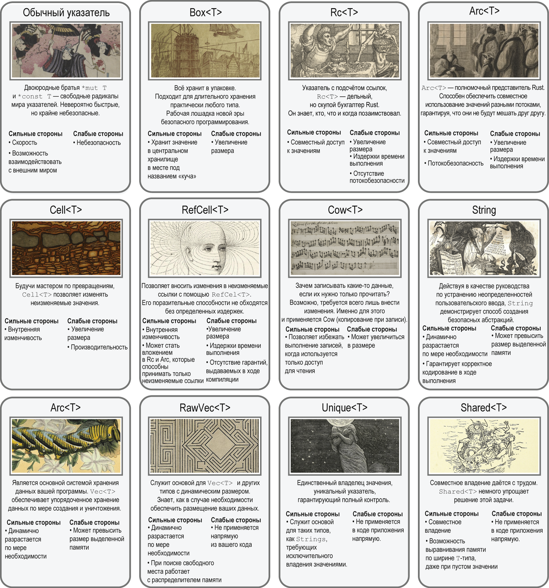

# Работа с памятью

## Указатели  

Указатель определяет порядок ссылок компьютеров на те данные, к которым нет непосредственного доступа.  
> Указатель - **число**, ссылающееся на что-либо иное. Число - адрес в памяти, представленный целым числом типа *usize*.  
> Адрес указывает на место в адресном пространстве.

- Адрес памяти - число, относящееся к одному байту в памяти. Это абстракция, предоставляемая языками Ассемблера;  
- Указатель - адрес памяти, указывающий на значение какого-либо типа. Это абстракция, предоставляемая языками более высокого уровня;  
- Ссылка в Rust представляет собой указатель. В случае с типами, имеющими динамический размер - указатель и целое число с дополнительными гарантиями.

***Адрес в памяти в отличие от ссылок и указателей не содержит информацию о типе данных, на который он ссылае***тся  

### Преимущества Rust ссылок над указателями  

1. Ссылки всегда указывают на реально существуюшие данные
2. Ссылки корректно выровнены по кратным *usize*
3. Ссылки гарантируют производительную работу с типами, имеющими динамически изменяемый размер

> В типы RUST включаются байты заполения.  
> Для типов не имеющих фиксированную ширину размещения в памяти, Rust гарантирует, что их размер будет сохраняться рядом с внутренним указателем.  

**{:p}** - требование отформатировать переменную в виде указателя и вывести адрес памяти.  

### Классический указатель в Rust

Адрес памяти. Стандартные гарантии Rust на него не распространяются, что делает его небезопасным. Может иметь значение *null*.  
`*const T` - неизменяемый указатель, `*mut T` - изменяемый.  

- Разница между `*const T` и `*mut T` минимальна. Они могут свободно приводиться друг к другу;
- Rust ссылки `&mut T` и `&T` при компиляции превращаются в обычные указатели  
- Обычный указатель не является владельцем своего значения => RUST не проверяет доступность данных, на которые указывается
- Допускается использование нескольких обычных указателей на одни и те же данные  

### Интеллектуальные указатели в Rust  

Это типы, обладающие помимио способности определять адрес в памяти несколькими *дополнительными свойствами*.  
Типы интеллектуальных указателей служат оболочкой для обычных указателей и наделяют их дополнительной семантикой.  

> "Толстый" указатель - указатель, имеющий ширину > usize в два и более раз.  

  

> При наличии внутренней изменчивости может понадобиться предоставить аргумент методу, принимающему неизменяемые значения, но при этом сохранить изменчивость. Если методу требуется значение, которым он завладеет, необходимо заключить аргумент в `Cell<T>`. Ссылки заключаются в `RefCell<T>`.
При использовании типов с подсчётом количества ссылок `Rc<T>` и `Arc<T>`, принимающих только неизменяемые аргументы также исполтзуеются `Cell<T>` и `RefCell<T>`. Например `Rc<RefCell<T>>`.  

## Предоставление программам памяти для размещения данных  

### Стек  

> Реализован по принципу LIFO: Last In, First Out

- Стек содержит два уровня объектов: кадры стека и данные
- Стек предоставляет доступ не только к верхнему элементу, но и к нескольким хранящимся в нём элементам
- Стек может включать в себя объекты произвольного размера

> Записи - кадры стека. Кадры создаются по мере выполнения вызовов функций. В ходе выполнения программы указатель стека внутри CPU обновляется, отражая фактический адресс текущего кадра стрека. Т.к. функции вызываются внутри функций, *значение указателя стека по мере его роста уменьшается*. Когда *происходит возврат из функции, указатель стека увеличивается*.  
 Кадры стека содержат состояние функции на момент вызова. Когда функция вызывается внутри функции, значения более старой фактически замораживаются воо времени. Каждый кадр стека имеет разный размер. В нём имеется *пространство для аргументов его функции, указатель на исходное место вызова и значения локальных переменных* (за исключением тех данных, что размещены в куче).  
> ***Основная роль стека - предоставить место для локальных переменных. Причина быстрой работы стека - все переменные и функции находятся в памяти рядом друг с другом***  

#### Улучшение эргономики функций, способных принимать только String или &str  

Эти два типа имеют разные представления в памяти. Для `&str` выделяется место в стеке, а для `String` в куче. Следовательно, эти два типа нельзя просто так привести друг к другу  

    // Функция получает аргумент пароля T, где в T реализуется AsRef<str>
    // Средства реализации AsRef<str> ведут себя как &str, даже если это не соответствует действительности
    // Такой приём используется, когда требуется доступ только по чтению
    fn is_password_strong <T: AsRef<str>> (password: T) -> bool {
        password.as_ref().len() > 5
    }